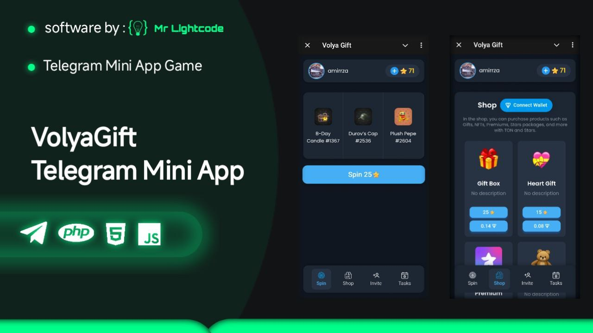
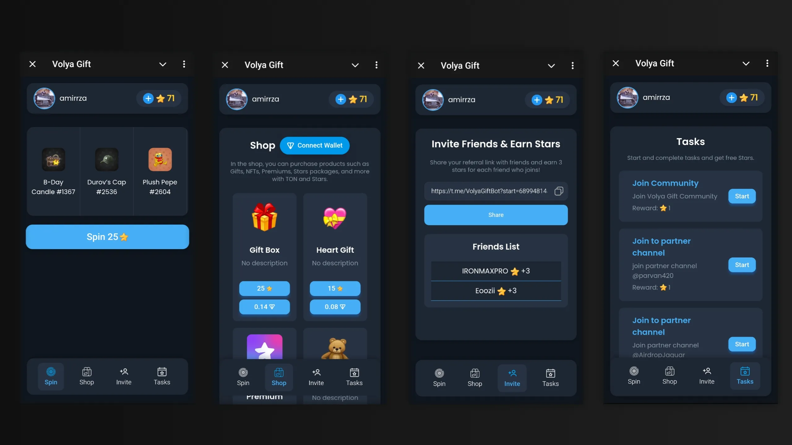
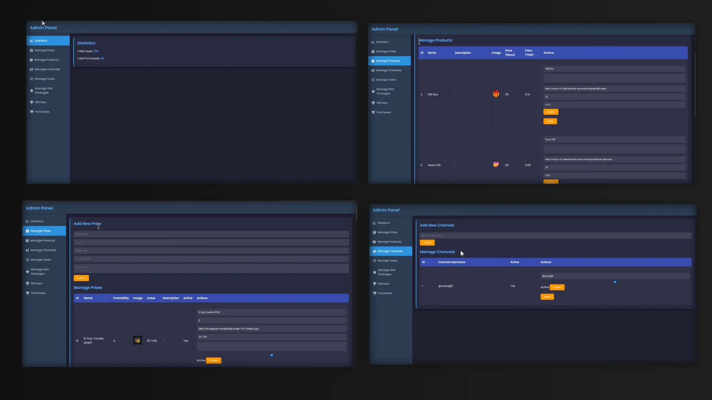
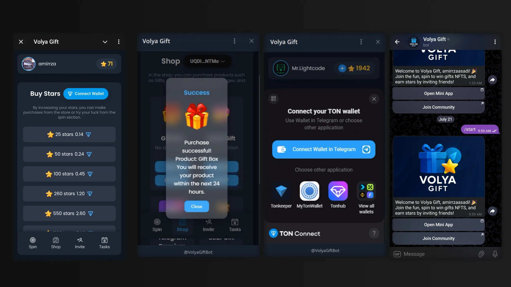
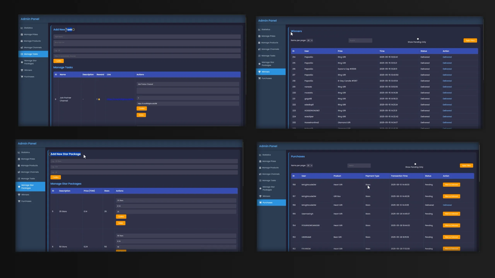

# 🎁 VolyaGift – Earn TON & NFTs with Telegram Mini App (Open-source Preview)

> VolyaGift is a **Telegram Mini App** that lets users earn **TON coins** and **NFTs** by spinning a wheel. Ideal for Telegram-based crypto projects, TON ecosystem dApps, and interactive community growth tools.

---

## 🔥 Key Features

- 🎰 **Spin-to-win mechanic**: Earn TON coins or NFTs  
- 🛍️ **In-app shop**: Redeem earned points for rewards  
- 📊 **Admin panel**: Monitor users, prizes & stats  
- 💳 **TON Wallet Integration**: Using TonConnect  
- 📱 **Fully responsive UI** – mobile-first experience  
- ⚙️ Perfect for **TON projects**, **Telegram communities**, and **NFT campaigns**

---

## 📺 Demo Video

Watch full demo here:  
👉 [https://youtu.be/XQBT0QlLKRI](https://youtu.be/XQBT0QlLKRI)

---

## 📸 Screenshots

| Mini App UI                                   | Admin Panel                                  |
|----------------------------------------------|----------------------------------------------|
|  |  |
|  |  |

---

## 🛒 Buy the Source Code

You can purchase the **full source code**, including the Mini App frontend and Admin Panel backend, from the link below:

🔗 [Buy Now – mrlightcode.shop](https://mrlightcode.shop/product/telegram-mini-app-earn-ton-nfts/)

---

## 💬 Questions?

Message me on Telegram if you're interested in partnership, custom development, or licensing:

👉 [@MrLightcode](https://t.me/MrLightcodeDM)

---

## 💡 Who Is It For?

- Developers looking for a TON-based Telegram Mini App starter  
- TON ecosystem projects seeking engaging reward mechanics  
- Telegram crypto group owners & airdrop organizers  
- NFT marketers or gamification enthusiasts  
- Web3 investors exploring TON dApp use cases

---

## 🌐 Built With

- **Next.js** (React frontend)  
- **PHP** (backend for Admin Panel)  
- **MySQL** (user/reward data)  
- **Tailwind CSS**  
- **TonConnect SDK**  
- **TON Blockchain APIs**

---

## 🔐 Note

This repository is only a **preview**. The **complete working source code** is available upon purchase.  
For questions or custom solutions, feel free to reach out on Telegram.

---
